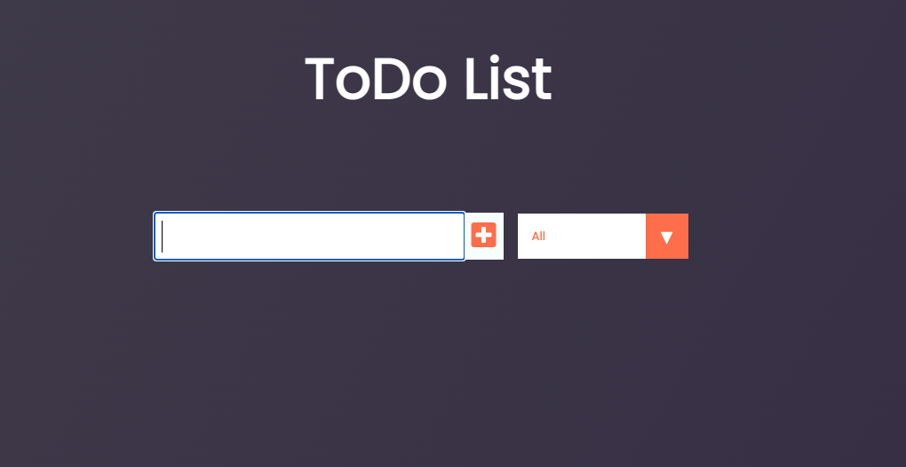

# ToDo List - Mini React Proyect

This is a simple app, realized to practice simple React Js features.

## Instructions to use the app locally
1. Download dependecies with:
### `npm install`
2. Run the app locally with:
### `npm run dev`
3. To create a deployment build use:
### `npm build`